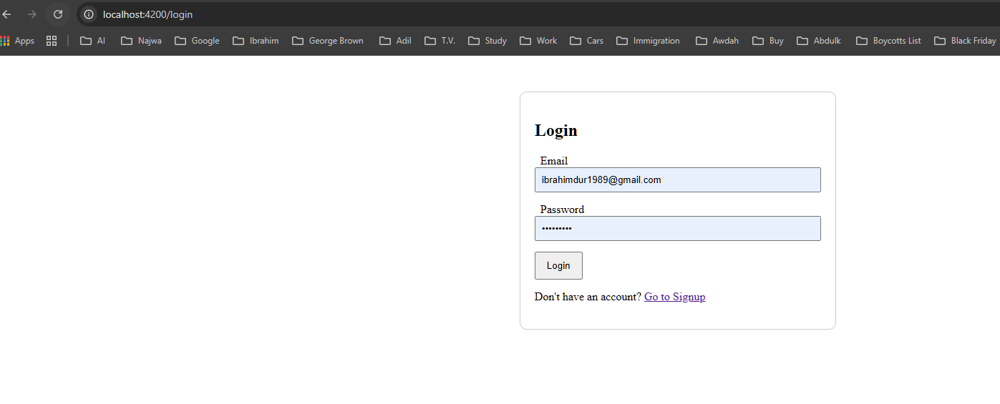
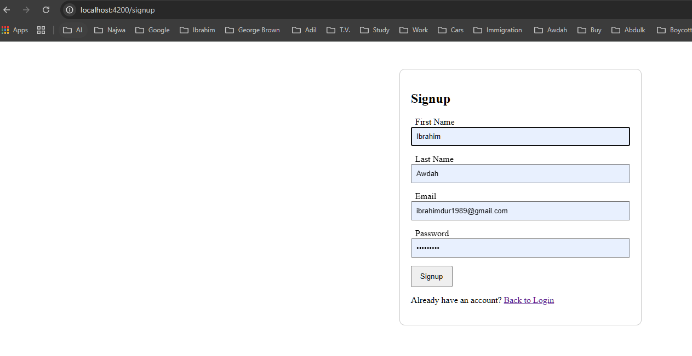
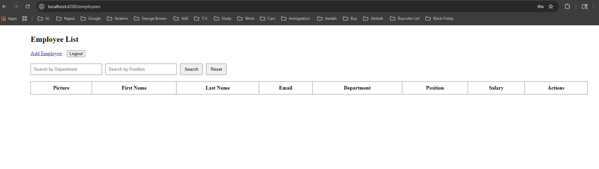
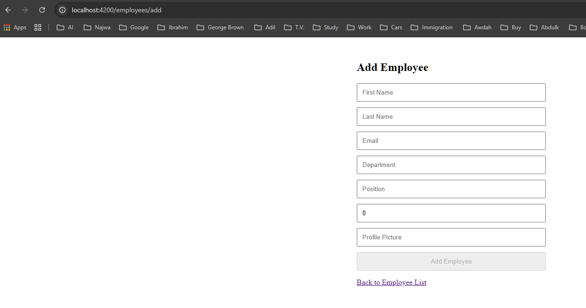

#COMP3133 – Assignment 2

## Student Information
- Name: Ebrahim Al-Serri
- Student ID: 101085527

## Project Description
This project is a full-stack web application developed using Angular for the frontend and Node.js with GraphQL for the backend.
The application allows users to register, login, and manage employee records.

## Features
- User Signup and Login
- Session Management
- Employee List Display
- Add New Employee
- Update Employee Information
- Delete Employee
- Search Employees by Department or Position
- Logout Functionality

## Technologies used
- Angular
- Node.js
- Express
- GraphQL
- MongoDB
- Mongoose
- HTML/CSS/Bootstrap

## How to Run the Project

GitHub Repository

Backend: 
https://github.com/Ibrahimdur1989/COMP3133_101085527_Assignment1.git 

Frontend: 
https://github.com/Ibrahimdur1989/101085527_comp3133_assignment2.git

Notes
Make sure the backend is running before starting the frontend
The project uses GraphQL for employee operations

### Backend
1. Open the backend folder
2. Run: 
```bash 
npm install 
npm start
```

### Frontend
1. Open the backend folder
2. Run: 

```bash 
npm install
ng serve
```

### Open in browser:
```bash
http://localhost:4200
```

## Screenshots

### Login


###Signup


###EmployeeList


### Add Employee
